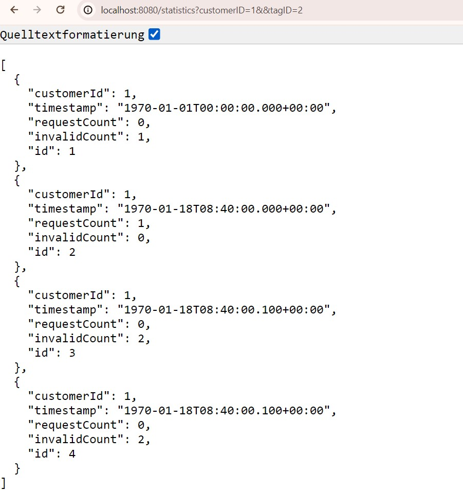

# Statistics service

This application counts the number of valid and invalid requests according to the requested customer ID, day and the JSON data file that contains requests.

There are two endpoints  to display them:
- http://localhost:8080/statistics?customerID=1&&tagID=2 to get the statistics (invalid and valid requests separately) about the customerID #1 for the day#2
- http://localhost:8080/total?customerID=1&&tagID=2 to get the number of requests (sum of invalid + valid requests) about the customerID #1 for the day#2

The application contains an H2 database that can be seen on localhost:8080/h2-console. The username and password are initialized in the application properties file.

## Installation
_Note: Please pay attention to the structure if you change the file `requests.json` in the `resources `folder:
`{ "requests": [ {object}, {object},...]}`_

Here are the instructions:
- load or clone the project
````shell
git clone https://github.com/nadia-mm/statistics.git
````
- run StatisticsApplication.java in your IDE

 ## Task
The HTTP service does the following ones:
- receives requests from a JSON file
- checks the validity of each request
- rejects invalid requests
- counts and stores statistics per customer per hour

The service also provides an endpoint to get the statistics for:
  -  a specific customer ***AND***
  - a specific day
The response contains the total number of requests for that day.



### Requests considered as invalid are:
* malformed JSON (i.e. NOT `{"customerID":1,"tagID":2,"userID":"aaaaaaaa-bbbb-cccc-1111-222222222222","remoteIP":"123.234.56.78","timestamp":1500000000}` )
* missing one or more fields
* with a customer ID not found in the database or for a customer which is disabled
* with a remote IP address which is in the blacklist
* with a user agent which is in the blacklist

### The stats table will contain:
* one entry per hour and per customer ID
* the  `request_count` column contains the number of valid requests
* the `invalid_count` column will be used for the number of invalid requests

## Info
I used for the project:
- Apache Maven 3.6.2
- java version "1.8.0_221"
- Java(TM) SE Runtime Environment (build 1.8.0_221-b11)
- Java HotSpot(TM) 64-Bit Server VM (build 25.221-b11, mixed mode)

## Resources
- http://zetcode.com/springboot/datajpaquery/
- https://stackoverflow.com/questions/1688099/converting-json-data-to-java-object
- [JPQL](https://thorben-janssen.com/spring-data-jpa-query-annotation/)
- [Jackson API](https://www.concretepage.com/jackson-api/jackson-jsonformat-example)
- [GSON](https://www.tutorialspoint.com/gson/gson_object_serialization.html)
- [H2 database](http://www.h2database.com/html/functions.html)
- [SpringBoot with H2](https://www.baeldung.com/spring-boot-h2-database)
- [Spring Data JPA](https://www.baeldung.com/spring-data-jpa-query)
